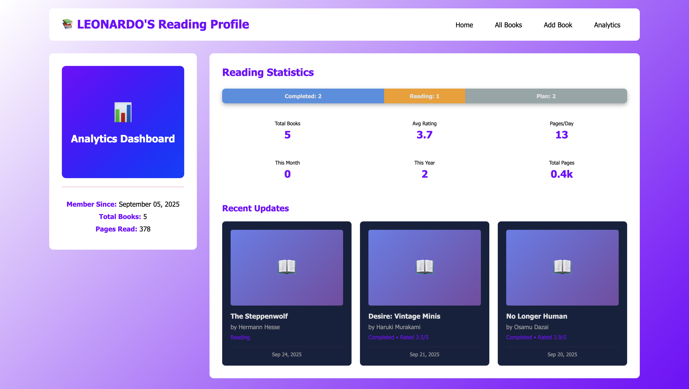
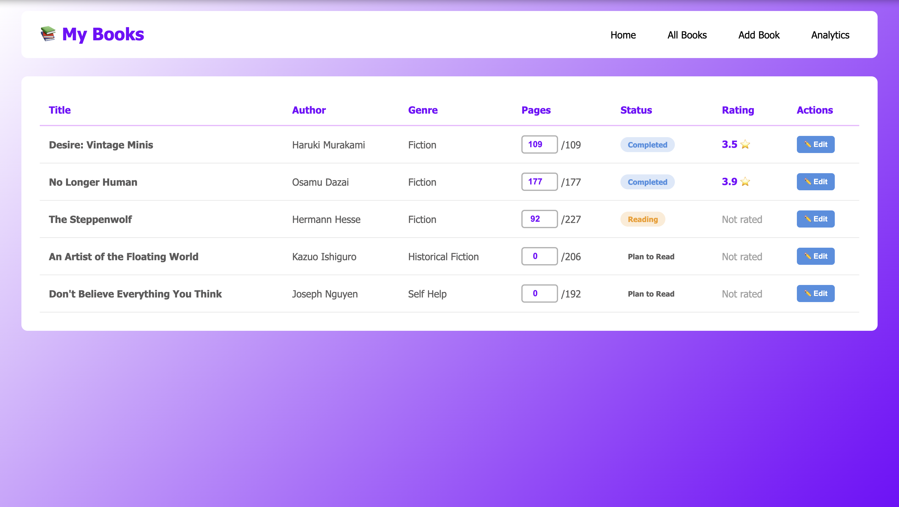
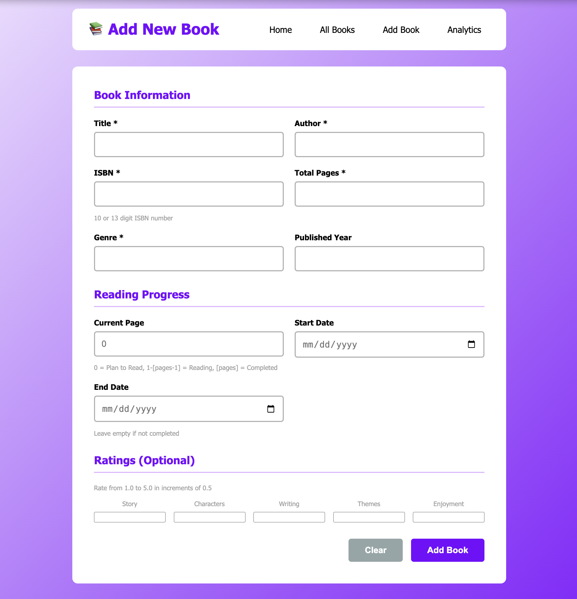

# smart-reading-log

## Overview
This project will combine creating a personal dashboard to keep track of books you enjoy, as well as provide analysis on data that can be retrieved from the information input, and a machine learning recommender system to provide insights and actionable recommendations from [book dataset that has yet to be decided].

It is designed to showcase both:
* Analytical storytelling using an Interactive Web Dashboard with SQL Data.
* Recommender system modeling in Python.

## Part 1: Business Analytics Dashboard (Interactive Web Dashboard with SQL Data)
I want to create a dashboard that tracks the books you read using an Interactive Web Dashboard with SQL Data. I will be adding a rating system to keep track of how much one likes a book. The rating system will contain five sub-categories: Story & Pacing, Characters & Development, Writing Style, Themes & Depth, and Emotional Impact & Enjoyment. This system will allow more in-depth analysis of how one rates a book. There will be multiple pages.

### The Home page displays:
* When you became a member (your earliest start date)
* The total books in your database that include the ones you've completed, you're reading, and that you plan to read
* The average number of pages you read a day
* The number of books you've read this month and this year
* The total number of pages you've read
* You're recent updates (Last three books updated)

#### Preview:

### The All Books page displays information on the books in your list, such as:
* Title
* Author
* Genre
* Pages You've Read / Total Pages
* Reading Status
* Rating (If you click on the rating button, it shows the distribution of which categories got what score)
* Edit button

#### Preview:

### The Add Book and Edit Book pages allow you to input or edit:
* All the information in the All Books page
* Current pages read
* Start and End dates
* ISBN

#### Preview (the edit book page looks the same with a different title):

### The analytics page displays:
* A spider chart breaking down the average rating of each category
* A trend line on how many pages you read a day
* A pie chart showing the distribution of genres you read
* A bar chart showing the average rating per genre
* A bar chart showing how many books you rated 1.0, 1.5, 2.0... up to 5.0

#### Preview:
[add when finished]

## Things I need to work on asap:
* More of the analytics page

## Part 2: Recommender System (Python)
I want to create a recommender system based on the books you've read and liked. It will examine the overall rating (the average of the five sub-categories) you provided, the genre, the number of pages, and any other relevant factors that come to mind.
