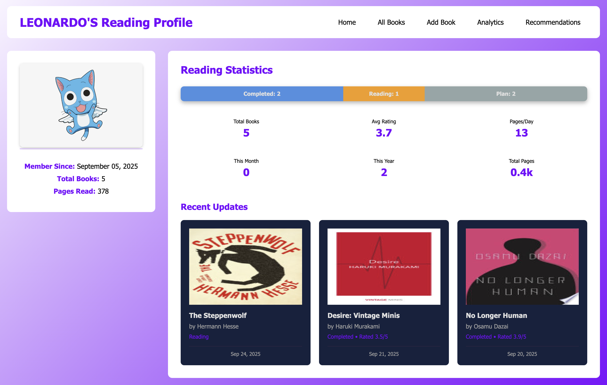

# smart-reading-log

## Overview
This project is a **personal reading dashboard** that allows users to track the books they’ve read, analyze reading data, and receive personalized book recommendations using the Google Books API.  

It showcases two main components:  
1. **Analytical storytelling** via an interactive web dashboard with SQL data.  
2. **Recommender system modeling** in Python to provide actionable insights.

---

## Part 1: Business Analytics Dashboard (Interactive Web Dashboard with SQL Data)

The dashboard provides a comprehensive way to track your reading habits and rate books across multiple dimensions. The rating system includes five sub-categories:  
- Story & Pacing  
- Characters & Development  
- Writing Style  
- Themes & Depth  
- Emotional Impact & Enjoyment  

This enables **more in-depth analysis** of your reading preferences.

### Home Page
Displays key statistics at a glance:  
- Member since (earliest start date)  
- Total books in your library (completed, currently reading, planned)  
- Average pages read per day  
- Books read this month and year  
- Total pages read  
- Most recent updates (last three books updated)  

#### Preview

---

### All Books Page
Shows detailed information about each book in your library:  
- Title  
- Author  
- Genre  
- Pages read / Total pages  
- Reading status  
- Ratings (click to see category breakdown)  
- Edit button for modifications  

#### Preview

---

### Add Book / Edit Book Pages
Allows users to input or edit book information, including:  
- All fields from the All Books page  
- Current pages read  
- Start and end dates  
- ISBN  

#### Preview

---

### Analytics Page
Visualizes reading habits and book ratings using interactive charts:  
- **Spider chart** for average rating per category  
- **Trend line** for pages read per day  
- **Pie chart** for genre distribution  
- **Bar chart** for average rating per genre  
- **Bar chart** showing rating distribution from 1.0 to 5.0  

#### Preview
[Add screenshot when finished]

## Part 2: Book Recommender System

This project provides **personalized book recommendations** tailored to a user’s reading history, favorite authors, and top genres. It integrates with the **Google Books API** to fetch up-to-date book information, including titles, authors, genres, thumbnails, and descriptions.

### Features

- **Genre-based recommendations**
  - Analyzes the user’s top-read genres.
  - Fetches highly-rated books from Google Books in those genres.
  - Filters out books the user already owns using ISBN.

- **Author-based recommendations**
  - Considers the user’s favorite authors.
  - Suggests additional works by those authors, avoiding duplicates.

- **Duplicate avoidance**
  - Checks existing books in the user’s library (by ISBN) to prevent repeated recommendations.

- **Book details included**
  - Title, authors, genre(s), short description (truncated to 200 characters), and a thumbnail image.
  - Gracefully handles missing information (e.g., no description or thumbnail).

- **Curation and limits**
  - Returns up to **12 recommendations** per user session.
  - Shuffles results to provide a diverse selection each time.

### Implementation Details

- **Backend:** Python + Flask  
- **API Integration:** Google Books API (`volumes` endpoint)  
- **Database:** Stores existing books with ISBNs for duplicate checking.  
- **Error Handling:**  
  - Skips over network errors or missing fields without crashing.
  - Handles missing thumbnails and descriptions gracefully.

### Notes

- Recommendations are **dynamic**; Google Books API results may change over time.
- Thumbnail images may occasionally not load if Google’s temporary URLs expire.
- Optional improvements include caching API responses to provide more consistent recommendations.

#### Preview:

